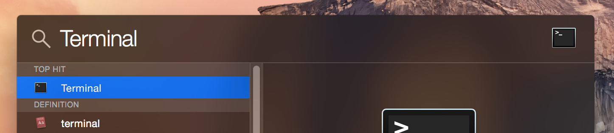

# spoof [![travis][travis-image]][travis-url] [![npm][npm-image]][npm-url] [![downloads][downloads-image]][downloads-url] [![javascript style guide][standard-image]][standard-url]

[](https://greenkeeper.io/)

[travis-image]: https://img.shields.io/travis/feross/spoof/master.svg
[travis-url]: https://travis-ci.org/feross/spoof
[npm-image]: https://img.shields.io/npm/v/spoof.svg
[npm-url]: https://npmjs.org/package/spoof
[downloads-image]: https://img.shields.io/npm/dm/spoof.svg
[downloads-url]: https://npmjs.org/package/spoof
[standard-image]: https://img.shields.io/badge/code_style-standard-brightgreen.svg
[standard-url]: https://standardjs.com

### Easily spoof your MAC address in macOS, Windows, & Linux!

Node.js port of the popular [SpoofMAC](https://pypi.python.org/pypi/SpoofMAC/) Python utility (GitHub: [feross/SpoofMAC](https://github.com/feross/SpoofMAC)).


## Why?

I made this because changing your MAC address on macOS is harder than it should be. The Wi-Fi card needs to be manually disassociated from any connected networks in order for the change to apply correctly – super annoying! Doing this manually each time is tedious and lame.

Instead, just run `spoof` and change your MAC address in one command.

**Now for Windows and Linux, too!**

## Instructions for beginners

Here are some easy install instructions for complete beginners.

1. Install [node.js](http://nodejs.org/) (it's a programming platform like Python, Java, etc.)

2. Open **Terminal**. Let's use Spotlight to find it.

  

3. Install **spoof** by typing this command and pressing `Enter`.

  ```bash
  npm install spoof -g
  ```

  That's it! **spoof** is installed.

3. Now, let's print out the **help page**. Just like before, run this command in **Terminal**.

  ```bash
  spoof --help
  ```

4. Now, let's print out all our network devices.

  ```bash
  spoof list
  ```

5. Find the device you want to set or randomize the MAC address for in the list. Wi-Fi is usually called `en0` on modern Macs. Then, run this command:

  ```bash
  sudo spoof randomize en0
  ```

  You may need to reconnect to the Wi-Fi hotspot you were connected to. But, that's it! Your MAC address is changed. You can confirm by re-running:

   ```bash
   spoof list
   ```

## Full command list

You can always see up-to-date usage instructions by running spoof --help.

### List available devices

```bash
spoof list
- "Ethernet" on device "en0" with MAC address 70:56:51:BE:B3:00
- "Wi-Fi" on device "en1" with MAC address 70:56:51:BE:B3:01 currently set to 70:56:51:BE:B3:02
- "Bluetooth PAN" on device "en1"
```

### List available devices, but only those on Wi-Fi

```bash
spoof list --wifi
- "Wi-Fi" on device "en0" with MAC address 70:56:51:BE:B3:6F
```

### Randomize MAC address *(requires root)*

You can use the hardware port name, such as:

```bash
spoof randomize wi-fi
```

or the device name, such as:

```bash
spoof randomize en0
```

### Set device MAC address to something specific *(requires root)*

```bash
spoof set 00:00:00:00:00:00 en0
```

### Reset device to its original MAC address *(requires root)*

While not always possible (because sometimes the original hardware MAC
isn't available), you can try setting the MAC address of a device back
to its burned-in address using `reset`:

```bash
spoof reset wi-fi
```

On macOS, another option to reset your MAC address is to simply restart your
computer. macOS doesn't preserve changes to your MAC address between restarts.

## Linux support?

Yep!

Linux support requires the `ifconfig` utility to be installed. It comes
pre-installed with most Linux distributions.

## Windows support?

Yep!

## Automatically randomize MAC address on startup

If you want to set or randomize your MAC address and have it persist between restarts on
macOS, consider using the Python version of this program,
[SpoofMAC](https://github.com/feross/SpoofMAC), and following the instructions
for [running automatically on startup](https://github.com/feross/spoofmac#optional-run-automatically-at-startup).

## License

MIT. Copyright [Feross Aboukhadijeh](https://feross.org).
